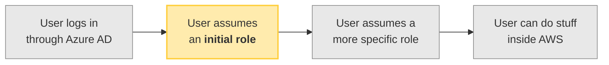
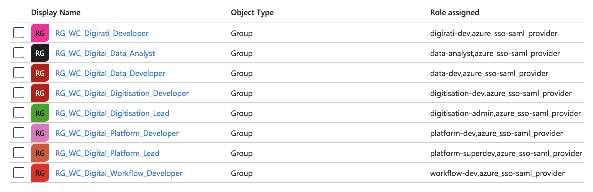

# Initial role

This module defines the **initial role** that users assume when they first log in to AWS.

This initial role can't do anything except assume a more specific IAM role.
It's a "stepping stone" into our AWS estate.

## Which initial role do you use?

The initial roles are handled by [User Groups in the Azure AD application][users_and_groups] for the Platform AWS account.

---

Each of these initial roles is linked to [a Group in the Azure AD application][users_and_groups].

Everybody who can log in to our AWS estate is in at least one of these groups.
Every group is associated

When you log in to AWS, your initial role is determined by the role assigned to each of the groups that you're in.

> **Example 1.**
> Suppose you're a member of the `RG_WC_Digital_Data_Analyst` group.
> The roles assigned to this group are `data-analyst` and `azure_sso-saml_provider`.

> **Example 2.**
> Suppose you're a member of the `RC_WC_Digital_Platform_Developer` and `RC_WC_Digital_Workflow_Developer` groups.

[users_and_groups]: https://portal.azure.com/#view/Microsoft_AAD_IAM/ManagedAppMenuBlade/~/Users/objectId/c300392b-56aa-4a3e-8d2c-249ce2d5468d/appId/3bfb9ee4-2ec9-40e0-8432-10cd46f9afe4
