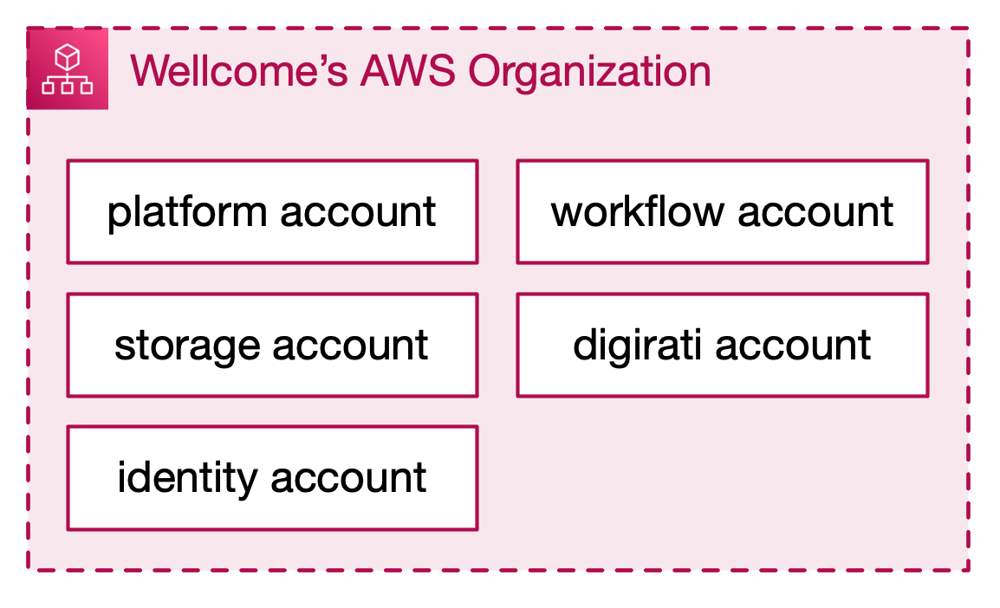

# AWS account infrastructure

There are a number of different AWS accounts for Wellcome Collection, which sit under the Wellcome [AWS Organization].
The different accounts provide a coarse level of isolation between different services.

Each account is used for different things, but there are some common pieces among the accounts, including:

*   Our approach to users, IAM roles, permissions
*   Our approach to networking
*   How we log into the accounts

This GitBook space describes some of the theory and principles behind our AWS account setup.

[AWS Organization]: https://docs.aws.amazon.com/organizations/latest/userguide/orgs_manage_accounts.html

