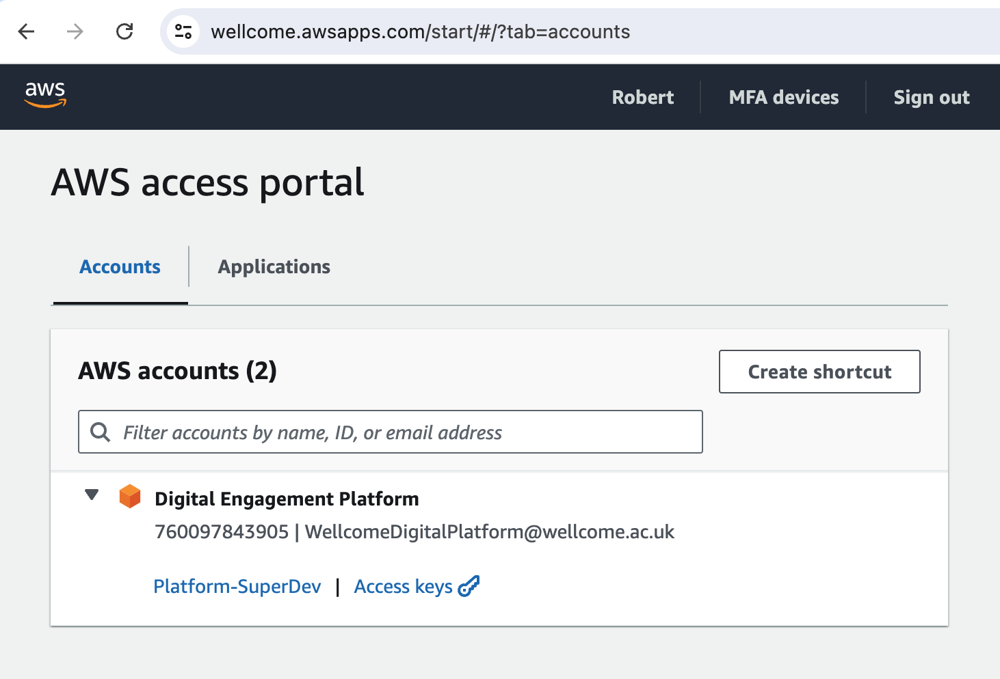

# How to get credentials for working locally, e.g. the AWS CLI

Developers can get short-lived credentials for working locally (lasting up to 4 hours).

This is meant to reduce the risk profile of lost secrets; e.g. if a laptop is stolen, it's less likely to have useful AWS credentials than if we all had long-lived, permanent credentials.

You can use the `aws` CLI application to do this when signing in via IAM Identity Center.

To configure your CLI for single sign on you can:

1.  Follow the instructions to [log into the AWS console](./how-to-log-in-to-the-aws-console.md) to ensure you have access.
   
2.  Return to the IAM Identity Center app, or [visit this link](https://wellcome.awsapps.com/start/#/?tab=accounts).
   
3.  Select the "Access Keys" option for the "Digital Engagement Platform" account.

    

4. You should see instructions for multiple ways in which to use your temporary credentials. 
   To set up your CLI to work with collection AWS roles, run:
   
   ```console
   > aws configure sso
   SSO session name (Recommended):
   WARNING: Configuring using legacy format (e.g. without an SSO session).
   Consider re-running "configure sso" command and providing a session name.
   SSO start URL [https://wellcome.awsapps.com/start/#]:
   SSO region [eu-west-1]:
   There are 2 AWS accounts available to you.
   Using the account ID 760097843905
   The only role available to you is: platform-superdev
   Using the role name "platform-superdev"
   CLI default client Region [eu-west-1]:
   CLI default output format [None]:
   ```

   The SSO session name should can be empty. Specify the start URL and region from the instructions. **When asked to select a profile name specify `default`**.

5. Ensure that your `./aws/credentials` file matches the one [credentials file] in this repository. **If there is already a `default` profile specified this process will fail.**

6. Once the configuration process is complete you can sign-in using the command:
   
   ```console
   aws sso login
   ```

   After sign-in, you will assume an [initial role](https://docs.wellcomecollection.org/aws-account-setup/users-iam-roles-accounts-and-so-on/what-is-an-initial-role).
   
   You then need to assume a [specific role](https://docs.wellcomecollection.org/aws-account-setup/users-iam-roles-accounts-and-so-on/what-are-our-standard-roles) to start doing things.

[credentials file]: https://github.com/wellcomecollection/aws-account-infrastructure/blob/main/accounts/credentials.ini