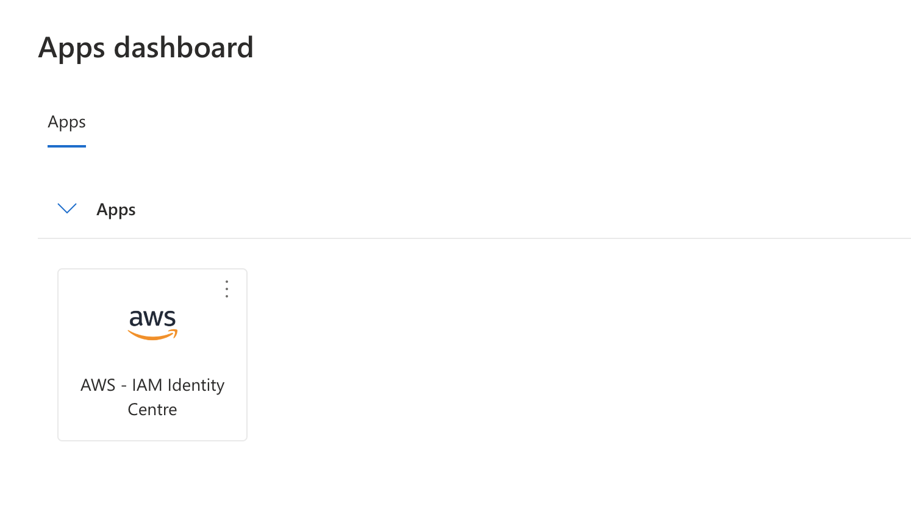
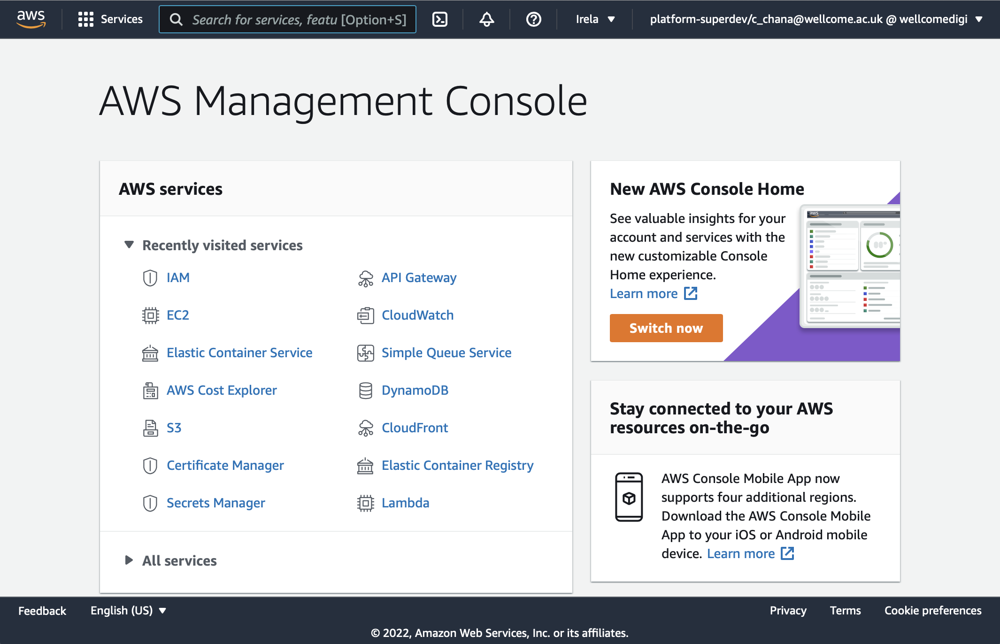
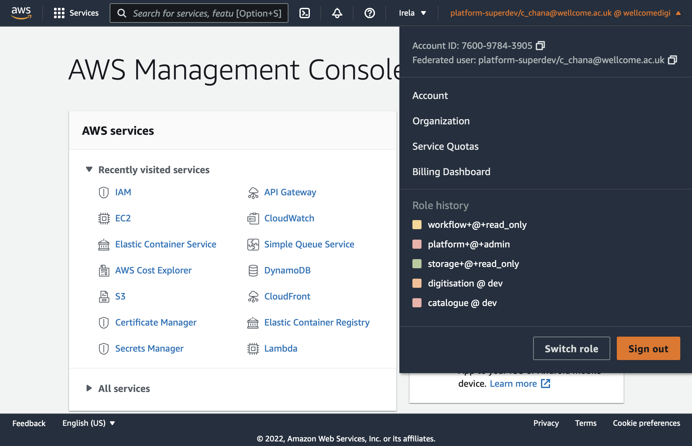
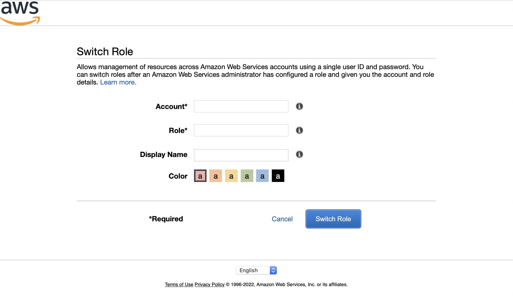

# How to log in to the AWS console

1.  Visit <https://myapps.microsoft.com/>.
    Log in using your `c_` account, e.g. `c_chana@wellcome.ac.uk`.

2.  You should see a list of apps.
    Select the app named "AWS - IAM Identity Center".

    If you can't see that app, it means you don't have access to our AWS accounts.
    Talk to a/another developer.

    

3.  You should be taken to the AWS IAM Identity center login page.
    Select the account called "Digital Engagement Platform", and the "Platform-Dev" role.

    

4.  You should be taken to the AWS console.

    

5.  Your default role can't do anything; it can only assume specific roles in other accounts.
    To assume a role, click the menu in the top right-hand corner, and click "Switch Role".

    

6.  You should be taken to a "Switch Role" screen.
    Enter the account ID and name of the role you want to assume, then click "Switch Role".

    

Some developers use the [AWS Extend Switch Roles extension][ext] in Google Chrome, which adds a list of all our roles to the top right-hand menu.
We have a [config file] you can use with the extension.

[ext]: https://chrome.google.com/webstore/detail/aws-extend-switch-roles/jpmkfafbacpgapdghgdpembnojdlgkdl
[config file]: https://github.com/wellcomecollection/aws-account-infrastructure/blob/main/accounts/chrome_extension_config.ini
