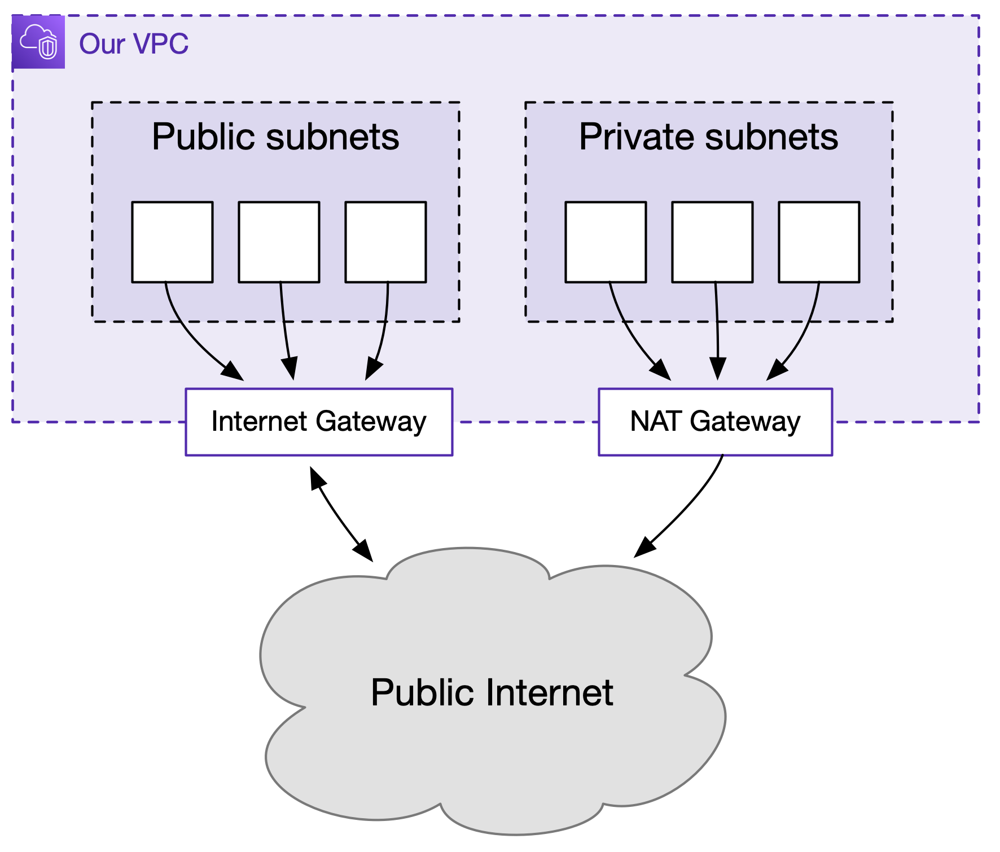

# Our VPC setup

The design of our VPC and networking is based on [Practical VPC Design][practical].

A [VPC (virtual private cloud)][vpc] is an isolated network inside AWS.
Within the VPC, everything can talk to everything else – the question is what can talk to the outside world.

We split our services into public-facing and private, and we create matching subnets.

[practical]: https://medium.com/aws-activate-startup-blog/practical-vpc-design-8412e1a18dcc
[vpc]: https://docs.aws.amazon.com/vpc/latest/userguide/what-is-amazon-vpc.html

## Public-facing services

Public-facing services that we want to be reachable externally go into public subnets  (for example, EC2 instances that we need to be able to SSH into).
These connect to the Internet through an Internet Gateway, and each resource will have its own external IP address.

The services can connect out to the Internet, and the Internet can connect back in.

## Private services

Private services that we don't want to be reachable externally go into private subnets (for example, data pipelines).

These can connect **out** to the public Internet through a NAT Gateway, but the Internet can't connect back in.

The NAT Gateway is associated with a fixed Elastic IP address, which means that all requests coming from our private services will come from a single IP address.

