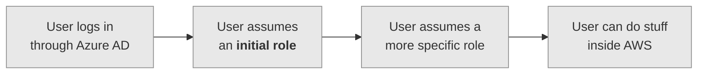

# How we think about users, permissions, etc.

This is how you get to stuff inside our AWS accounts:

1.  A user logs in through Azure Active Directory (Azure AD).
    All our AWS access is tied to single-sign on accounts -- we manage our users in Azure AD rather than in AWS.

2.  The user assumes an "initial role" inside AWS.
    This is an IAM role, where [IAM][iam] is the AWS service for managing permissions and access to AWS resources.

    This role can't do anything except assume other roles.

3.  The user assumes a more specific role, which has permission to do whatever they need to do.

    There are lots of these roles, each of which has fairly specific permissions.
    The different roles are a sort of guard rail -- you pick a role for the current task, which allows you to do what you need to do, but you can't accidentally break something completely different.

    For example, if you're changing something in the catalogue API, you'd pick a role that lets you modify the catalogue API resources.
    That role wouldn't have permission to modify the storage service, so there's no risk of you breaking it inadvertently.

    There are different roles for different accounts (e.g. storage, dlcs, workflow) and for different permission levels within each account (e.g. read-only, admin).

4.  The user can then do whatever is allowed by the role they've picked.

[iam]: https://aws.amazon.com/iam/